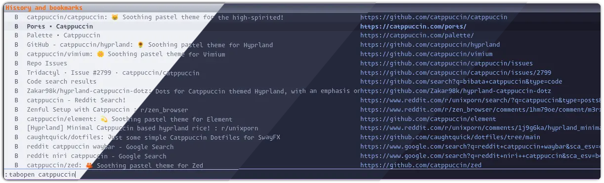
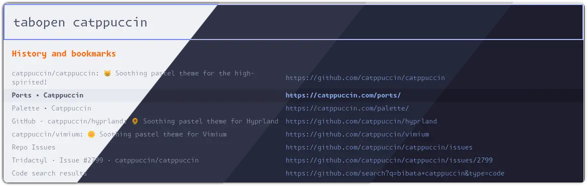
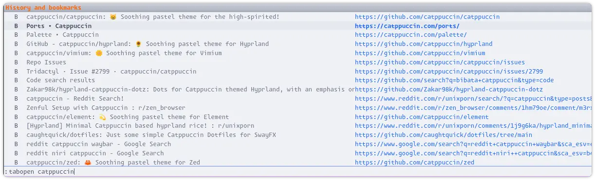
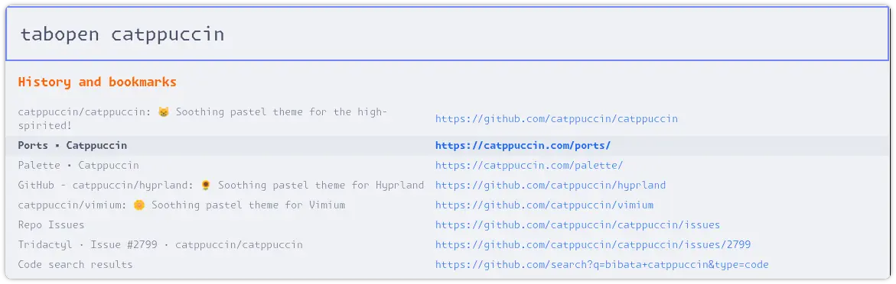
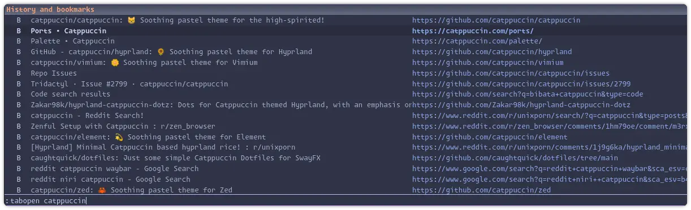
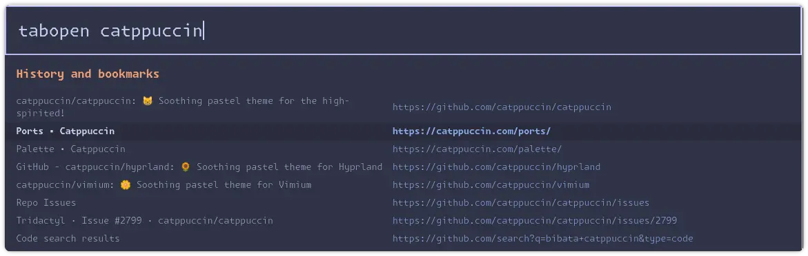
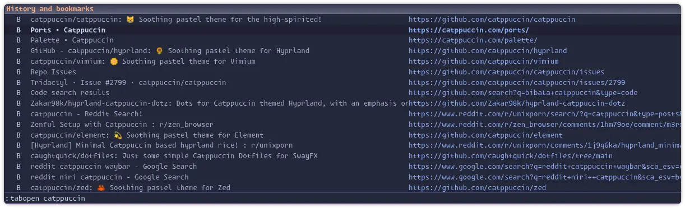
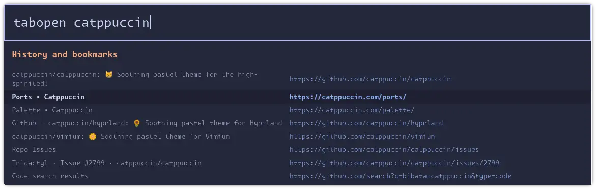
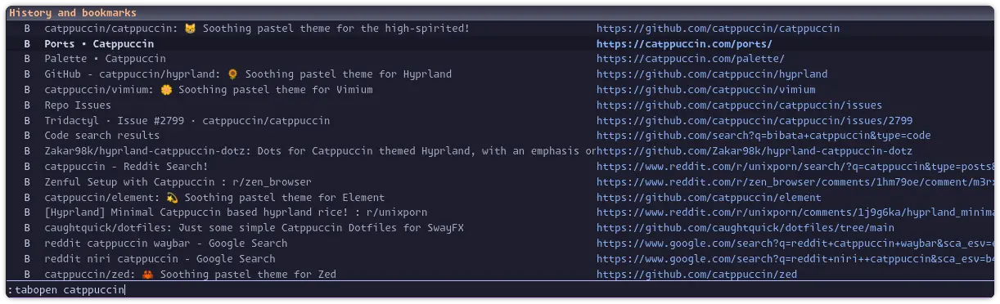
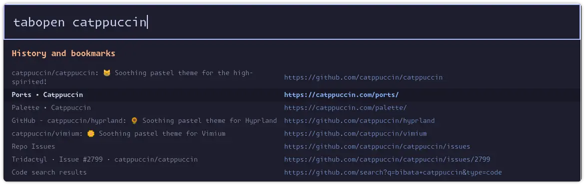

<h3 align="center">
	<br/>
	
	Catppuccin for <a href="https://github.com/tridactyl/tridactyl">Tridactyl</a>
	
</h3>

<p align="center">
	<a href="https://github.com/devnullvoid/tridactyl/stargazers"></a>
	<a href="https://github.com/devnullvoid/tridactyl/issues"></a>
	<a href="https://github.com/devnullvoid/tridactyl/contributors"></a>
</p>

<p align="center">
  
</p>

## Vimium-Style Theme
<p align="center">
  
</p>

## Previews

<details>
<summary>🌻 Latte</summary>
  
  <br/>
  <strong>Vimium-Style Variant</strong>
  <br/>
  
</details>
<details>
<summary>🪴 Frappé</summary>
  
  <br/>
  <strong>Vimium-Style Variant</strong>
  <br/>
  
</details>
<details>
<summary>🌺 Macchiato</summary>
  
  <br/>
  <strong>Vimium-Style Variant</strong>
  <br/>
  
</details>
<details>
<summary>🌿 Mocha</summary>
  
  <br/>
  <strong>Vimium-Style Variant</strong>
  <br/>
  
</details>

## Usage

Catppuccin for Tridactyl ships **four families** of themes per flavor. Each flavor (`latte`, `frappe`, `macchiato`, `mocha`) is available in:

| Family | Color scheme | Layout | Notes |
| --- | --- | --- | --- |
| `catppuccin-<flavor>.css` | Modern (blue accent) | Default | Recommended starting point. Accent overridable at runtime. |
| `catppuccin-<flavor>-<accent>.css` | Modern (pre-baked accent) | Default | 13 files per flavor, one per non-blue accent (e.g. `-mauve`, `-peach`). |
| `catppuccin-<flavor>-vimium.css` / `-vimium-<accent>.css` | Modern | Vimium | Same accents available, with a Vimium-inspired layout. |
| `catppuccin-<flavor>-legacy.css` / `-vimium-legacy.css` | **Original** | Default / Vimium | First-release color scheme (rosewater / pink / green accents). |

### Quick start (Mocha examples)

```text
" Modern, default layout, blue accent
:colourscheme --url https://raw.githubusercontent.com/devnullvoid/tridactyl/main/themes/catppuccin-mocha.css catppuccin-mocha

" Modern, vimium layout, mauve accent
:colourscheme --url https://raw.githubusercontent.com/devnullvoid/tridactyl/main/themes/catppuccin-mocha-vimium-mauve.css catppuccin-mocha-vimium-mauve

" Legacy colors, default layout
:colourscheme --url https://raw.githubusercontent.com/devnullvoid/tridactyl/main/themes/catppuccin-mocha-legacy.css catppuccin-mocha-legacy
```

Replace `mocha` with `latte`, `frappe`, or `macchiato` for the other flavors.

### Available accents (modern variants)

The modern variants use a primary accent color for URLs, completion URL highlights, and (in the default layout) hint backgrounds. The default is **blue**. Pre-baked files are provided for every other Catppuccin color:

| Accent | Default layout file | Vimium layout file |
| --- | --- | --- |
| Blue *(default)* | `catppuccin-<flavor>.css` | `catppuccin-<flavor>-vimium.css` |
| Rosewater | `catppuccin-<flavor>-rosewater.css` | `catppuccin-<flavor>-vimium-rosewater.css` |
| Flamingo | `catppuccin-<flavor>-flamingo.css` | `catppuccin-<flavor>-vimium-flamingo.css` |
| Pink | `catppuccin-<flavor>-pink.css` | `catppuccin-<flavor>-vimium-pink.css` |
| Mauve | `catppuccin-<flavor>-mauve.css` | `catppuccin-<flavor>-vimium-mauve.css` |
| Red | `catppuccin-<flavor>-red.css` | `catppuccin-<flavor>-vimium-red.css` |
| Maroon | `catppuccin-<flavor>-maroon.css` | `catppuccin-<flavor>-vimium-maroon.css` |
| Peach | `catppuccin-<flavor>-peach.css` | `catppuccin-<flavor>-vimium-peach.css` |
| Yellow | `catppuccin-<flavor>-yellow.css` | `catppuccin-<flavor>-vimium-yellow.css` |
| Green | `catppuccin-<flavor>-green.css` | `catppuccin-<flavor>-vimium-green.css` |
| Teal | `catppuccin-<flavor>-teal.css` | `catppuccin-<flavor>-vimium-teal.css` |
| Sky | `catppuccin-<flavor>-sky.css` | `catppuccin-<flavor>-vimium-sky.css` |
| Sapphire | `catppuccin-<flavor>-sapphire.css` | `catppuccin-<flavor>-vimium-sapphire.css` |
| Lavender | `catppuccin-<flavor>-lavender.css` | `catppuccin-<flavor>-vimium-lavender.css` |

### Legacy variants

The `-legacy` variants preserve the first-release color scheme inspired by the [Catppuccin Vimium](https://github.com/catppuccin/vimium) theme, with rosewater URLs and pink/green completions accents. They are kept for users who prefer the original look or who installed the theme before the Catppuccin-team review changes.

---

## Building

Themes are generated from `.tera` templates using [whiskers](https://github.com/catppuccin/whiskers). To regenerate all 120 files:

```bash
whiskers tridactyl-default.tera
whiskers tridactyl-vimium.tera
whiskers tridactyl-default-legacy.tera
whiskers tridactyl-vimium-legacy.tera
whiskers tridactyl-default-accent.tera
whiskers tridactyl-vimium-accent.tera
```

The `*-accent.tera` templates use whiskers' matrix mode to iterate over `[flavor, accent]`, producing all non-blue accent variants in one command.

---

## 💝 Contributing

Contributions are welcome! If you have suggestions or improvements, feel free to open an issue or submit a pull request.

## 💝 Thanks to

- [devnullvoid](https://github.com/devnullvoid)

&nbsp;

<p align="center">
	
</p>

<p align="center">
	Copyright &copy; 2021-present <a href="https://github.com/catppuccin" target="_blank">Catppuccin Org</a>
</p>

<p align="center">
	<a href="https://github.com/catppuccin/catppuccin/blob/main/LICENSE"></a>
</p>
